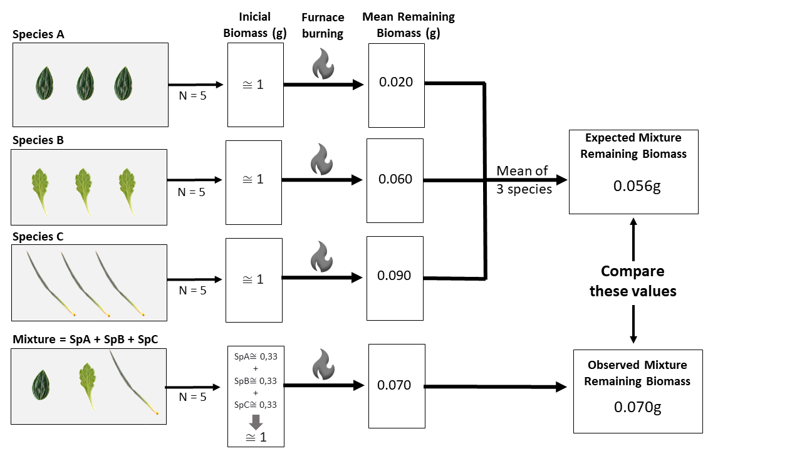

<!-- PROJECT SHIELDS -->
<!--
*** I'm using markdown "reference style" links for readability.
*** Reference links are enclosed in brackets [ ] instead of parentheses ( ).
*** See the bottom of this document for the declaration of the reference variables
*** for contributors-url, forks-url, etc. This is an optional, concise syntax you may use.
*** https://www.markdownguide.org/basic-syntax/#reference-style-links
-->

<!-- PROJECT LOGO -->
 

  <a href="https://github.com/helena-roland/Non-Additive-Effects-on-Plant-Mixtures-Flammability-in-a-Tropical-Mountain-Ecosystem">

<h3 align="center">Non-Additive Effects on Plant Mixtures Flammability in a Tropical Mountain Ecosystem</h3>

  

   Data and Rcode to reproduce analysis of the manuscript entitled "Non-Additive Effects on Plant Mixtures Flammability in a Tropical Mountain Ecosystem"
     
    <a href="https://github.com/helena-roland/Non-Additive-Effects-on-Plant-Mixtures-Flammability-in-a-Tropical-Mountain-Ecosystem"><strong>Explore the docs »</strong></a>
     
     
    <a href="https://github.com/helena-roland/Non-Additive-Effects-on-Plant-Mixtures-Flammability-in-a-Tropical-Mountain-Ecosystem">View Demo</a>
    ·
    <a href="https://github.com/helena-roland/Non-Additive-Effects-on-Plant-Mixtures-Flammability-in-a-Tropical-Mountain-Ecosystem/issues">Report Bug</a>
    ·
    <a href="https://github.com/helena-roland/Non-Additive-Effects-on-Plant-Mixtures-Flammability-in-a-Tropical-Mountain-Ecosystem/issues">Request Feature</a>
  

<!-- TABLE OF CONTENTS -->

  
Table of Contents

    <li>
      <a href="#about-the-project">About the project </a>
      </ul>
    <li>
      <a href="#statistical-analysis">Statistical Analysis</a>
    </ul>
    <li>
      <a href="#getting-started">Getting Started</a>
      </ul>
        <li><a href="#prerequisites">Prerequisites</a></li>
        <li><a href="#installation">Installation</a></li>
      </ul>
    </li>
    <li><a href="#contact">Contact</a></li>
    <li><a href="#references">References</a></li>
  </ol>

<!-- ABOUT THE PROJECT -->
## About The Project
Fire plays a vital role in ecosystems by shaping plant communities and favoring species that can survive or regenerate after fires (Bond et al., 2005; Bowman et al., 2009). The combustion of plant biomass significantly affects carbon balance, nutrient cycling, and global climate (Scott et al., 2013). Grasslands contribute to most global fires, accounting for large areas of burning and fire-related emissions (Stevens et al., 2020; van der Werf et al., 2017). While fire dynamics in savannas are well understood (Oliveras et al., 2016), there is limited knowledge about fire regimes in tropical montane grasslands, particularly with increasing climate change pressures.

In the Campos de Altitude, a tropical grassland ecosystem in southeastern Brazil located above 1,800 meters (Safford et al., 1999a), fire acts as a selective pressure, spreading through litter and herbaceous layers during dry seasons (Aximoff and Rodrigues, 2011; ICMBio, 2023). The combined effects of fire and human activities (Hantson et al., 2022, alongside rising temperatures and increasing aridity (Lyra et al., 2018), have led to concerns about drier vegetation and more severe fire regimes. These changes underscore the need for more research on fire severity and its impacts on montane grasslands (Safford, 2001).

Fire severity is influenced by fire behavior, which refers to how fire spreads and interacts with its environment (Rego et al., 2021). Since most wildfires in the Campos de Altitude are caused by human activity and often exhibit extreme behavior, understanding fire behavior is essential for effective management strategies (Hantson et al., 2022).  

Plant traits significantly influence fire behavior because they serve as the primary fuel source (Cardoso et al., 2018). Flammability traits, which determine how plants ignite and burn, include ignitability, combustibility, sustainability, and consumability (Pérez-Harguindeguy et al., 2013; Anderson, 1970). These traits affect fire behavior differently; for example, ignitability is tied to fire spread, while consumability relates to fire severity (Gill and Zylstra, 2005; Keeley, 2009). However, the interactions between these traits remain poorly understood, with relationships such as between ignitability and combustibility still unclear (Pausas et al., 2017; Boving et al., 2023). Understanding leaf flammability is especially important since leaves are the main fuel for surface fires in grasslands (Murray et al., 2013; Rego et al., 2021).

Interspecific differences in leaf flammability can be explained by chemical and morphological traits like volatile compounds, specific leaf area (SLA), and leaf dry matter content (LDMC) (Pausas et al., 2017). SLA influences ignition time, as leaves with higher SLA ignite more quickly due to their lower density and porosity (Murray et al., 2013; Grootemaat et al., 2015). LDMC is a good predictor of shoot flammability (Alam et al., 2020). Leaf traits also affect the flammability of litter fuels at the community level (Parsons et al., 2015). However, interactions among species can lead to non-additive effects, where the flammability of species mixtures differs from the sum of individual traits (de Magalhaes and Schwilk, 2012; van Altena et al., 2012). Functional diversity (FD) can lead to more complex ecological interactions, such as resource complementarity (Tilman et al., 1997; Petchey, Hector, and Gaston, 2004; Hooper et al., 2005).

This study is the first to analyze flammability in monospecific and mixed-species leaf mixtures in tropical montane ecosystems. By focusing on traits like SLA, LDMC, and flammability metrics such as Live Fuel Moisture Content at ignition (LFMCig) and Maximum Combustion Rate (MCR), this research aims to assess how these traits and functional diversity influence biomass consumability in species mixtures. Understanding consumability is critical since it indicates the amount of biomass consumed during a fire, which is directly related to fire severity.

Specifically we hypothesize that:  
- (H1) non-additive effects in community flammability will occur, with species of greater consumability dominating the flammability of the mixture 
- (H2) Consumability will be explained by morphological and flammability traits: 
- - (H2a) SLA will positively correlate with consumability as high SLA (i.e. less mass per unit area) will facilitate the heat and oxygen penetration within the leaf; 
- - (H2b) LDMC will positively correlate with consumability, as higher LDMC indicates more biomass available for combustion;
- - (H2c) LFMCig will have a positive relationship with consumability, since the higher the LFMCig, the greater the ignitability and, consequently, there is more time for the biomass to - - be consumed;
- - (H2d) MCR will positively correlate with consumability due to higher intensity of biomass loss. 
- (H3) Alternatively, we could find no direct relationship between individual traits and consumability, but rather a positive relationship between overall functional diversity and consumability, indicating that non-additive effects are driven by functional diversity among these four traits.

<!-- FIGURE 1 -->
 

  

<h3 align="left">Figure 1</h3>
Scheme of the consumability experiment for determining expected and observed values of remaining biomass.

(<a href="#readme-top">back to top</a>)

<!-- STATISTICAL ANALYSIS -->
## Statistical analysis

To assess significant differences in species consumability, we conducted Shapiro-Wilk and Levene tests for normality and homogeneity of the data. ANOVA was performed to determine significant differences among species. When significant differences were detected, we employed the Tukey test for multiple comparisons. For traits that did not meet normality and homogeneity assumptions even after Box-Cox transformation, we used the Kruskal-Wallis test and Dunn's test for multiple comparisons to determine species differences in SLA, LDMC, LFMC, MCR, and Average Consumability Contribution.

To test for non-additive effects, we conducted a paired t-test comparing the expected values for the remaining biomass of the mixtures (based on the values of their constituent species) with the observed values obtained from burning the mixtures (see Figure 1).

We estimated functional diversity for each of the 35 mixtures using the dbFD function from the FD R package (Laliberté & Legendre, 2010). We measured functional richness (FRic), indicating the volume of trait space occupied, and functional divergence (FDiv), showing how trait values diverge within this space. Given that all species in our mixtures had equal initial biomass, we treated their abundance as equal.

To link functional traits with consumability, we ran linear regressions between each trait’s mean value per mixture and the remaining biomass. We also assessed the relationship between functional diversity indices (FRic, FDiv) and consumability using linear regressions between these indices and the remaining biomass for each mixture.

<!-- GETTING STARTED -->

#### Prerequisites

You will need R version 4.3.1 (or greater) and the following R-packages installed and loaded in your computer to run the Rcode to reproduce the analysis of this project.

## 1 Script: Variance Analysis 

#### Getting Started

Before running the script, ensure you have the following libraries installed in R:
install.packages(c("ggpubr", "tidyverse", "rcompanion", "multcompView", "dunn.test", "FSA", "agricolae", "MASS"))

#### Load the Data:
The script assumes you have the data in an appropriate format, named as remaining.biomass, species.mean.contribution, mcr, FMCig, sla, and ldmc.

#### Run the Script:
After loading the data, you can run the script, which performs the following steps:

1.	Prepares the data by converting columns into appropriate formats.
2.	Conducts analysis of variance (ANOVA) to check for differences between groups.
3.	Applies transformations to the data when necessary (log, square root, Box-Cox).
4.	Performs non-parametric tests (Kruskal-Wallis) if ANOVA assumptions are not met.
5.	Generates multiple comparisons using Tukey's method and presents results in a compact letter display table.

## 2 Script: Paired T-Test

The Paired T-Test script is an R script that tests for non-additive effects in plant mixtures. It conducts a paired t-test between the Expected and Observed columns in the teste.t_table data frame and prints the results.

#### Prerequisites
Before running the script, ensure you have the following packages installed: install.packages(c("ecodados", "ggpubr", "gridExtra"))
To install the ecodados package directly from GitHub, use: devtools::install_github("your-github-repo/ecodados")

#### Load the Data:
The script expects the data to be available in the teste.t_table data frame, containing the Expected and Observed columns.

#### Run the Script:
To run the script, execute it in your R environment. The script performs the following steps:
1.	Conducts a paired t-test between the Expected and Observed columns and prints the results.
2.	Uses ggpaired to create a paired plot comparing Expected and Observed values, customizing various aesthetic elements like colors, sizes, and titles.
3.	Utilizes grid.arrange to display a box plot alongside the paired plot.

## 3 Script: Functional Diversity Analysis
The Functional Diversity Analysis script is an R script that performs functional diversity analysis using the FD package and conducts a series of linear regressions to investigate the relationship between functional variables and remaining biomass (FLAM). The results are exported to Excel files, and the regressions are plotted for visualization.

#### Prerequisites:
Before running the script, ensure you have the following packages installed:
install.packages(c("FD", "openxlsx", "ggplot2", "dplyr"))

#### Load the Data:
The script defines the path to the directory where the .txt files are stored, reads all .txt files, and combines them into a single data frame named table for analysis.

#### Run the Script:
To run the script, execute it in your R environment. The script performs the following steps:
1.	Loads the necessary packages.
2.	Lists the .txt files in the specified directory for processing.
3.	Transforms the data to prepare for functional diversity analysis, calculating necessary metrics.
4.	Computes functional diversity indices using the fd function and prints the results.
5.	Exports the functional diversity results to separate Excel files.
6.	Performs linear regressions to explore relationships between functional variables and remaining biomass (FLAM), printing the results.
7.	Generates plots for each regression analysis using ggplot2.

<!-- CONTACT -->
## Contact

Helena Roland Rodrigues Lima - helenarrlima1995@gmail.com

Project Link: [https://github.com/helena-roland/Non-Additive-Effects-on-Plant-Mixtures-Flammability-in-a-Tropical-Mountain-Ecosystem](https://github.com/helena-roland/Non-Additive-Effects-on-Plant-Mixtures-Flammability-in-a-Tropical-Mountain-Ecosystem)

(<a href="#readme-top">back to top</a>)

<!-- REFERENCES -->
## References

* Alam et al. (2020) Journal of Ecology
* Anderson (1970) Fire Technology
* Aximoff and Rodrigues (2011) Ciência Florest,
* Bond and Keeley (2005) Trends in Ecology & Evolution
* Bowman et al. (2009) Science
* Boving et al. (2023) Functional Ecology
* Cardoso et al. (2018)  Frontiers in forests and global change
* de Magalhaes and Schwilk (2012) Journal of Ecology
* Gill and Zylstra (2005) Austral Ecology
* Grootemaat et al. (2015) Functional Ecology
* Hantson et al. (2022) Nature communications
* Hooper et al. (2005) Ecological Monographs,
* ICMBio (2023) https://www.gov.br/icmbio/pt-br/centrais-de-conteudo/publicacoes/planos-de-manejo-integrado-do fogo/PMIFParnadoItatiaia_compressed.pdf
* Keeley (2009) International journal of wildland fire
*  Lyra et al. (2018) Theoretical and Applied Climatology
* Murray et al. (2013) PLoS One
* Oliveras et al. (2016) Philosophical Transactions of the Royal Society B: Biological Sciences
* Parsons et al. (2015) International journal of wildland fire
* Pausas et al. (2017) Journal of Ecology
* Petchey et al. (2004) Ecology
*  Pérez-Harguindeguy et al. (2013) Australian Journal of Botany
* Rego et al. (2021) Fire Science: From Chemistry to Landscape Management. Springer
* Safford (2001) Biotropica
* Safford et al. (1999a) Journal of Biogeography
*  Scott et al. (2013) Fire on Earth: An Introduction. Wiley-Blackwell.
*  Stevens et al. (2020) Annual Review of Environment and Resources
* Tilman et al. (1997) Science
* van Altena et al. (2012) Frontiers in Plant Science
* van der Werf et al. (2017) Earth System Science Data

(<a href="#readme-top">back to top</a>)

